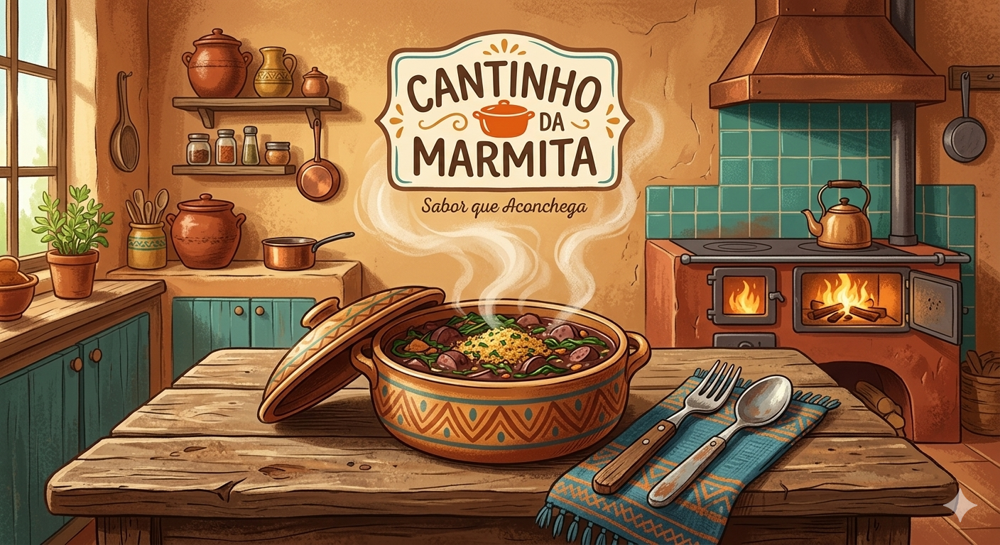

##Seja bem vindo!

## 🎯 Sobre o Projeto
O **Cantinho da Marmita** (uma loja fictícia de refeições caseiras) é um sistema de gestão interna desenvolvido com o objetivo principal de facilitar o dia a dia dos colaboradores. 

O foco central da aplicação é otimizar a **movimentação das marmitas**, garantindo que desde o momento do pedido até a entrega final, a equipe tenha um controle claro e ágil de cada etapa do processo.

### 🍱 Facilitando a Operação
* **Agilidade no Fluxo:** Substitui anotações manuais por um painel digital, evitando erros na separação dos pedidos.
* **Controle de Movimentação:** Permite acompanhar em tempo real quais marmitas estão em preparo, quais já estão prontas e quais saíram para entrega.
* **Organização Diária:** Facilita a visualização do estoque de marmitas disponíveis para o dia, ajudando a equipe a se planejar melhor para o horário de pico.
* **Interface Amigável:** Design pensado para ser simples e funcional, focado na produtividade de quem trabalha na operação.

## 🛠️ Tecnologias Utilizadas
* **PHP / Laravel** (Framework principal)
* **Blade** (Engine de templates)
* **Tailwind CSS / Bootstrap** (Estilização)
* **Vite** (Build tool)

## 🚀 Funcionalidades
* ✅ Cadastro e gerenciamento de clientes.
* ✅ Controle de pedidos em tempo real.
* ✅ Cardápio dinâmico para marmitas do dia.
* ✅ Mural de avisos integrado para a cozinha.
